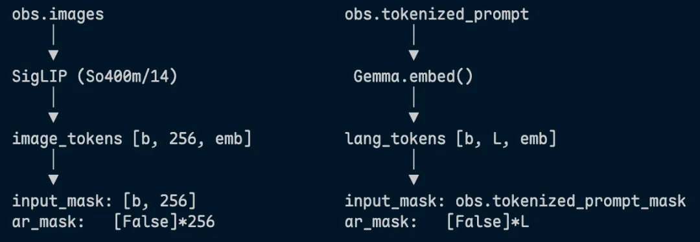

> 基于 π0.5 的 `openpi` 源码进行阅读和 action shape 调试。
> 重点关注：传感器数据如何经过数据适配层进入模型，以及 `prefix / suffix`、Multi-Expert Attention、Flow Matching 在源码中的对应关系。


## 目录

- [1. 阅读目标](#1-阅读目标)
- [2. 部件拆解](#2-部件拆解)
  - [2.1 Observation](#21-observation)
  - [2.2 Transform pipeline](#22-transform-pipeline)
  - [2.3 Droid 数据适配](#23-droid-数据适配)
  - [2.4 Libero 数据适配](#24-libero-数据适配)
- [3. Prefix 和 Suffix](#3-prefix-和-suffix)
  - [3.1 `embed_prefix()`](#31-embed_prefix)
  - [3.2 π0.5 中 state 如何写进 prompt](#32-π05-中-state-如何写进-prompt)
  - [3.3 `embed_suffix()`](#33-embed_suffix)
  - [3.4 `ar_mask` 的设计](#34-ar_mask-的设计)
- [4. Multi-Expert Attention](#4-multi-expert-attention)
  - [4.1 每层 Block 内部的流程](#41-每层-block-内部的流程)
  - [4.2 联合 attention](#42-联合-attention)
- [5. Flow Matching](#5-flow-matching)
- [6. Pipeline](#6-pipeline)
  - [6.1 Training pipeline](#61-training-pipeline)
  - [6.2 Inference pipeline](#62-inference-pipeline)
  - [6.3 KV-Cache 设计思路](#63-kv-cache-设计思路)
- [7. π0.5 和 π0 的主要差异](#7-π05-和-π0-的主要差异)
  - [7.1 suffix 构造差异](#71-suffix-构造差异)
  - [7.2 Time 如何注入？](#72-time-如何注入)
  - [7.3 AdaRMSNorm](#73-adarmsnorm)
- [8. 说明](#8-说明)
- [Reference](#reference)

---

## 1. 阅读目标

这份笔记主要围绕 `openpi` 源码中的 π0.5 实现展开，目标是搞清楚：

1. 原始传感器数据如何被适配成 `openpi` 统一输入；
2. `Observation / Actions` 的字段和 shape 如何组织；
3. `embed_prefix()` 和 `embed_suffix()` 分别构造了什么；
4. Multi-Expert Attention 如何让 prefix 与 suffix 发生交互；
5. Flow Matching 训练和推理时 action 的 shape 如何变化；
6. π0 与 π0.5 在 state 表示、suffix 构造和 time 注入方式上的差异。

需要注意的是，`openpi` 开源版中的 π0.5 和论文中完整的 π0.5 recipe 不完全一致。  
**在 `openpi` 这套开源版 π0.5 代码里，action 主要是 continuous action flow matching head，不是 discrete action token。**

---

## 2. 部件拆解

### 2.1 Observation

对应文件：`model.py`

`Observation` 是模型统一接收的输入格式，主要包括：

- `images`: dict，多路相机图像；
- `image_masks`: dict，标记哪些相机有效；
- `state`: 当前机器人低维状态；
- `tokenized_prompt`: 任务语言 token；
- `tokenized_prompt_mask`: prompt mask。

> 所有机器人 / 数据集最后都要被“翻译”成 `openpi` 统一的 `Observation + Actions` 格式。

---

### 2.2 Transform pipeline

对应文件：`transforms.py`、`droid_policy.py`、`libero_policy.py`

数据从原始数据集进入模型之前，会经过一系列数据适配和变换：

```text
RepackTransform
    重命名 key
-> DataTransforms
-> Normalize
    state + actions 做归一化
-> ModelTransforms
    InjectDefaultPrompt
    -> ResizeImages(224, 224)
    -> TokenizePrompt(max_len=48)
    -> PadStatesAndActions(32)
```

可以把这一层理解为：

```text
原始机器人 / 数据集字段
    ↓
数据适配层
    ↓
openpi 统一字段
    ↓
模型可接收的 Observation / Actions
```

---

#### Normalize：z-score vs Quantile

```text
z-score:
    (x - mean) / std
    用于 Pi0

quantile:
    (x - q01) / (q99 - q01) * 2 - 1
    缩放到 [-1, 1]
    用于 Pi0-FAST / Pi05
```

这一步的作用是把不同数据集、不同机器人上的 state 和 action 拉到统一数值范围，避免不同自由度、不同量纲的数据直接混在一起训练。

---

#### PadStatesAndActions

`pad_to_dim` 会用零填充到 `model_action_dim`，默认是 32 维。

目的是：让不同自由度的机器人能共享同一个 32 维 action space 的预训练空间，输出时再裁剪回各自真实维度。

---

### 2.3 Droid 数据适配

Droid 中 state 的构造：

```python
state = np.concatenate([
    data["observation/joint_position"],   # (7, )
    data["observation/gripper_position"], # (1, )
])  # -> (8, ) state
```

图像和 mask 的处理：

```python
case _model.ModelType.PI0 | _model.ModelType.PI05:
    names = ("base_0_rgb", "left_wrist_0_rgb", "right_wrist_0_rgb")
    images = (base_image, wrist_image, np.zeros_like(base_image))
    image_masks = (np.True_, np.True_, np.False_)
```

这里右腕图像用零值填充，同时设置 `mask = False` 让模型自动忽略该路图像。

输出维度处理：

```python
return {"actions": np.asarray(data["actions"][..., :8])}
```

模型内部输出 32 维 action，但 Droid 只使用前 8 维。

---

### 2.4 Libero 数据适配

Libero 的输入样例：

```python
{
    "observation/state": float32(8, ),             # 8 维状态
    "observation/image": uint8(224, 224, 3),       # 基座相机
    "observation/wrist_image": uint8(224, 224, 3), # 腕部相机
    "prompt": "do something",
}
```

Libero 和 Droid 的字段名不同，但经过适配后，都会变成统一的：

```text
images
image_masks
state
tokenized_prompt
actions
```

---

## 3. Prefix 和 Suffix

prefix 是条件上下文；suffix 是动作生成部分，也就是当前动作去噪过程中的中间变量。
理解 `embed_prefix()` 和 `embed_suffix()`，本质上就是理解：

```text
embed_prefix(): 条件部分如何构造
embed_suffix(): 动作部分如何构造
```

可以通俗理解为：

```text
prefix：题目
suffix：当前答案草稿
```

在 π0.5 的 flow matching 路径中：

```text
prefix:
- image tokens
- text prompt tokens
- discrete state tokens

suffix:
- noisy action tokens
```

---

### 3.1 `embed_prefix()`

`embed_prefix()` 负责把图像、语言 prompt，以及 π0.5 中离散化后的 state 变成 prefix tokens。

图像路径中，一张 224 × 224 × 3 的图像经过 SigLIP 后，通常得到：

$$
(B, 224, 224, 3) \rightarrow (B, 256, 1152)  
$$

其中：

$$
256 = (224 / 14)^2  
$$

`1152` 是 SigLIP 的输出维度。随后通过 `img_proj` 投影到 PaliGemma 的 hidden dim：

$$
1152 \rightarrow 2048  
$$

因此一张图像最终变成：

$$
(B, 256, 2048)  
$$

---

### 3.2 π0.5 中 state 如何写进 prompt

在 `tokenizer.py` 源码中，可以看到 π0.5 对 state 的处理：

```python
if state is not None:
    # This is the Pi05 format, where the state is part of the discrete language input.

    discretized_state = np.digitize(state, bins=np.linspace(-1, 1, 256 + 1)[:-1]) - 1
    state_str = " ".join(map(str, discretized_state))
    full_prompt = f"Task: {cleaned_text}, State: {state_str};\nAction: "
    tokens = self._tokenizer.encode(full_prompt, add_bos=True)
```

这里 state 会被离散化，拼接成 π0.5 类似的 prompt，然后交给 tokenizer：

```text
Task: pick up the cup, State: 118 103 084 ...;
Action:
```

核心设计思想：**用 token 化的方式，把 state 拉进 VLM 语义空间。**

---

### 3.3 `embed_suffix()`

`embed_suffix()` 负责把当前噪声动作 $x_t$ 和时间步 $t$ 编码为 suffix tokens。

在 flow matching 推理中，每一次去噪迭代时 $x_t$ 都会变化，因此 `embed_suffix()` 也需要在每一步重新调用。

π0 和 π0.5 在 suffix 构造上不同：

```text
pi0:
    时间 + 动作 显式混合后通过 MLP

pi0.5:
    time_emb -> adarms_cond for AdaRMSNorm conditioning
    action_tokens -> action_expert_tokens
```

也就是说，π0.5 中时间步 $t$ 不再主要作为 token 直接拼到 action 输入中，而是通过 `adarms_cond`，传入 `PaliGemma.llm` / action expert，用于 AdaRMSNorm 的条件调制。

原理部分见 [π0.5 论文笔记](../notes/papers/π0.5.md) AdaRMSNorm 节。

---

### 3.4 `ar_mask` 的设计

在 π0 路径中，一个典型的 `ar_mask` 可以理解为：

```text
[True,  True, False, False, ..., False]
   ↑       ↑     ↑              ↑
  state  act_0  act_1  ...    act_49
         新因果组       组内因果
```

含义：

- `prefix`（图像 + 语言）不能 attend 到 `state / suffix`；
    
- `state` 可以 attend 到 `prefix`；
    
- action tokens 之间是因果注意力；
    
- `cumsum(ar_mask)` 给每个因果块分配递增编号；
    
- `act_0` 可以看到 `state + act_0`；
    
- `act_1` 可以看到 `state + act_0 + act_1`；
    
- 以此类推，`act_i` 不能看到未来的 `act_{i+1...}`。
    

这类 mask 的核心作用是：

```text
允许 suffix 利用 prefix 条件；
避免 prefix 被 suffix 反向污染；
同时控制 action tokens 内部的可见关系。
```

---

## 4. Multi-Expert Attention

OpenPI / π0 系列采用的是 Multi-Expert Attention 机制。  
它不是把 prefix 和 suffix 简单拼接后喂给一个完全同构的 Transformer，而是使用两个 expert 分别处理不同维度、不同语义的 token。

- **expert 0**：处理 `prefix`，对应 **PaliGemma / VLM 主干**
    
- **expert 1**：处理 `suffix`，对应 **Action Expert**
    

两条分支的 `hidden_dim` 不同：

prefix 输入：

$$
X^{(0)} \in \mathbb{R}^{B \times T_p \times 2048}  
$$

suffix 输入：

$$
X^{(1)} \in \mathbb{R}^{B \times T_s \times 1024}  
$$

其中：

- prefix 工作在 2048 维的 PaliGemma 语义空间；
    
- suffix 工作在 1024 维的 action expert 空间。
    

`prefix: 816 tokens`，`suffix: 51 tokens`，沿 token 维度拼接后，形成一条联合序列，总长为 867 tokens。

---

### 4.1 每层 Block 内部的流程

每一层 Multi-Expert Transformer Block 可以概括为：

```text
expert0: prefix -> Q/K/V -> RoPE
expert1: suffix -> Q/K/V -> RoPE
            ↓
        concat Q/K/V along token dimension
            ↓
        joint attention
            ↓
        split by token boundary
            ↓
        expert0 FFN / expert1 FFN
```

对 prefix 分支：

$$
Q^{(0)} = W_Q^{(0)}X^{(0)}, \quad  
K^{(0)} = W_K^{(0)}X^{(0)}, \quad  
V^{(0)} = W_V^{(0)}X^{(0)}  
$$

对 suffix 分支：

$$
Q^{(1)} = W_Q^{(1)}X^{(1)}, \quad  
K^{(1)} = W_K^{(1)}X^{(1)}, \quad  
V^{(1)} = W_V^{(1)}X^{(1)}  
$$

然后在 token 维度拼接：

$$
Q = \operatorname{concat}(Q^{(0)}, Q^{(1)})  
$$

$$
K = \operatorname{concat}(K^{(0)}, K^{(1)})  
$$

$$
V = \operatorname{concat}(V^{(0)}, V^{(1)})  
$$

这里的 `concat` 是沿着 sequence / token 维度拼接，不是沿 hidden 维度拼接。

---

### 4.2 联合 attention

联合 attention 公式为：

$$
A = \operatorname{softmax}\left(\frac{QK^\top}{\sqrt{d}} + M\right)  
$$

$$
O = AV  
$$

其中：

- (M) 是 attention mask；
    
- (A) 是联合序列上的注意力矩阵；
    
- (O) 是联合序列的输出。
    

如果总 token 数是：

$$
T = T_p + T_s  
$$

那么 attention 矩阵大小为：

$$
A \in \mathbb{R}^{B \times T \times T}  
$$

---

> [!attention] 两个 expert 共享了什么，没有共享什么？
> 
> - prefix 和 suffix expert 各自产生自己的 Q / K / V；
>     
> - Q / K / V 会被拼成一条统一序列；
>     
> - 二者在**同一套 attention softmax** 里计算相关性；
>     
> - attention 输出后按 token 边界拆回去；
>     
> - FFN 仍然各自独立。
>     

---

## 5. Flow Matching

```text
input: noisy action tokens
output: flow matching vector field
```

在 [Flow Matching](../notes/concepts/Flow%20Matching.md) 里已经介绍过 flow matching 的基本概念，这里只看源码中 `compute_loss()` 的实现逻辑。

训练时，模型并不是直接预测 clean action，而是预测从当前 noisy action 到目标分布所需的 velocity field。

对应代码：

```python
noise = jax.random.normal(noise_rng, actions.shape) # sampling noise
time = jax.random.beta(time_rng, 1.5, 1, batch_shape) * 0.999 + 0.001
time_expanded = time[..., None, None]
x_t = time_expanded * noise + (1 - time_expanded) * actions
u_t = noise - actions # target vector field
```

训练目标：

$$
\mathcal{L}_{FM} = \operatorname{MSE}(v_t, u_t)  
$$
---

## 6. Pipeline

### 6.1 Training pipeline

训练时有 ground-truth actions，因此 suffix 来自真实 actions 和 noise 的插值。

```text
Observation + prompt + state + actions
↓
数据变换 / tokenization
↓
prefix / suffix 构造
↓
flow matching: noise, t, x_t, u_t
↓
action expert 前向
↓
v_t
↓
MSE(v_t, u_t)
```

---

### 6.2 Inference pipeline

推理时没有 ground-truth actions，因此 suffix 从纯高斯噪声开始。

```text
图像 + 语言指令
↓
数据适配 / tokenization
↓
prefix forward -> 填 KV cache
↓
初始化 x_t = Gaussian noise
↓
flow-matching ODE 循环（10 步）
↓
final action chunk: [B, H, A]
```

---

### 6.3 KV-Cache 设计思路

Prefix 由图像和语言 embedding 构成，在整个去噪过程中保持不变。  
因此可以先进行一次 prefix forward，并把对应的 KV cache 缓存起来。

之后每次去噪迭代时，只需要重新计算 suffix 的前向传播：

```text
prefix: 不变，提前缓存
suffix: 每一步 x_t 变化，需要重新计算
```

这样可以避免每个 denoising step 都重复计算 prefix，提高推理效率。

---

## 7. π0.5 和 π0 的主要差异

### 7.1 suffix 构造差异

#### State 的处理

π0 中：

```text
state 是 continuous state token；
和 noisy action 一起进入 suffix。
```

π0.5 中：

```text
state 被离散化；
写进 prompt；
通过 tokenizer 进入 prefix。
```

具体实现见上文 `embed_prefix()` 部分。

---

### 7.2 Time 如何注入？

π0 的做法：

```text
time embedding
    ↓
repeat 到 action horizon
    ↓
和 action tokens concat
    ↓
通过 MLP 融合
```

这种方式是把时间步显式拼接进输入 token，缺点是随着层数增加，时间信息可能逐步稀释。

π0.5 的做法：

```text
time embedding
    ↓
adarms_cond
    ↓
AdaRMSNorm conditioning
    ↓
注入 action expert 每一层
```

也就是说，π0.5 不再主要把时间步当成 token 输入，而是通过 `adarms_cond` 控制 AdaRMSNorm，把时间条件注入到每一层 action expert 中。

---

### 7.3 AdaRMSNorm

AdaRMSNorm 在 RMSNorm 的基础上，额外根据条件 `cond` 做动态调制。

核心作用：

将时间步 $\tau$ 的信息注入 action expert 的归一化层，避免噪声和时间步直接拼接。

代码形式：

```python
# adaRMSNorm（Action Expert）
modulation = self.modulation(cond) # (B, dim*3)
scale, shift, gate = modulation[:, None, :].chunk(3, dim=-1)
# scale: (B, 1, dim), shift: (B, 1, dim), gate: (B, 1, dim)

normed = normed * (1 + scale) + shift
return normed.to(dtype), gate
```

其中：

- `scale`：控制归一化后特征的缩放；
    
- `shift`：控制归一化后特征的平移；
    
- `gate`：控制 residual 分支的注入强度。
    

`gate` 实现了门控残差：

```python
# pi0.5: gated residual
x = x + attn_out * gate

# pi0: normal residual
x = x + attn_out
```

这里 `gate` 来自 `time_emb`，表示在当前去噪阶段，attention 输出有多大比例应该加入到残差中。

---

## 8. 说明

需要注意的是，`openpi` 开源实现和 π0.5 论文中的完整设定不完全一致。

在论文中，π0.5 涉及 discrete action representation 与 continuous action flow matching 的结合；  
但在 `openpi` 这套开源版 π0.5 代码里，主要能看到的是 continuous action flow matching head。

也就是说：

**在 `openpi` 开源版 π0.5 中，action 不是 discrete token，而是连续向量，从训练到推理都围绕 continuous action flow matching 展开。**

---

## Reference

以下列出在阅读理解源码部分有帮助的教程。

- [读懂 OpenPI 的 π0.5：从源码出发，真正看懂模型结构、训练逻辑和推理过程](http://zhuanlan.zhihu.com/p/2016189344914896039)
    
- [https://zhuanlan.zhihu.com/p/1968019610067538043](https://zhuanlan.zhihu.com/p/1968019610067538043)