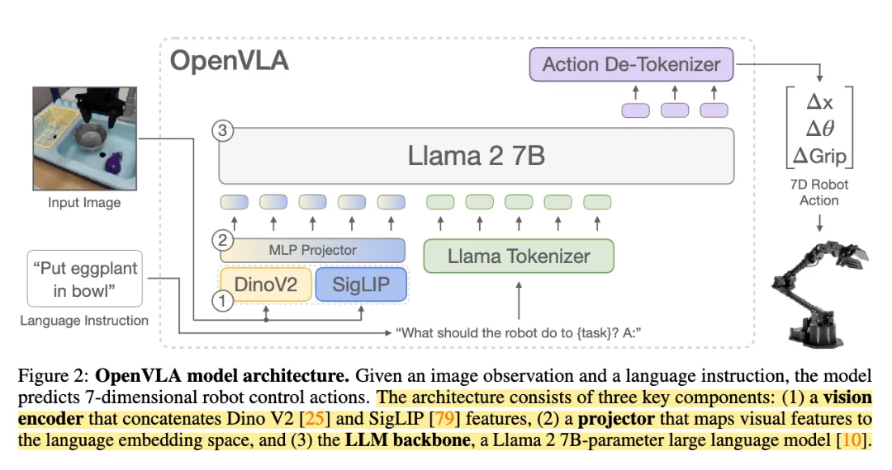

## 架构主线
输入：一张机器人视角图像 和 一句自然语言指令 
图像
`image -> vision encoder(combined with DINOv2 & SigLIP) -> 2-layer MLP Projector -> LLama embedding space`
语言
```text
In: What action should the robot take to {instruction}?
Out:
```
image token 和 text token 一起送入 Llama 2 7 B，复用 LLM 的 next-token-prediction 机制，生成 action tokens，在 action tokens 上计算 cross-entropy loss。

最后输出的 action 表示：`action = [Δx, Δy, Δz, Δroll, Δpitch, Δyaw, gripper]`

### Action tokenizer
**核心思想**
**把连续动作离散化成 token，让 LLM 像生成文本一样生成动作。**
训练时，每一个连续动作维度都会被单独离散化到 256 个 bins。
假设原始连续动作是：`a = [Δx, Δy, Δz, Δroll, Δpitch, Δyaw, gripper]`，即
```python
action = [
    Δx, Δy, Δz,        # 末端执行器位置变化
    Δroll, Δpitch, Δyaw,  # 末端执行器姿态变化
    gripper            # 夹爪开合
]
```
训练前会变成：`a_bins = [b0, b1, b2, b3, b4, b5, b6]`
这 7 个离散 bin 会被映射成 Llama tokenizer 里的 7 个 action token，直接覆盖 Llama 词表中最后 256 个最小使用的 token，把它们作为 action tokens。

假如某个训练样本的离散动作是：
`action_bins = [159, 115, 204, 140, 120, 168, 255]`
通过映射得到：
`action_token_ids = [31903, 31859, 31948, 31884, 31864, 31912, 31999]`

> [!WARNING] 为什么用 1st quantile 和 99th quantile，而不用 min/max？
> 忽略 outlier actions 异常值。

推理时，detokenizer 即可。类似于 `31903 -> bin 159 -> continuous action value`
