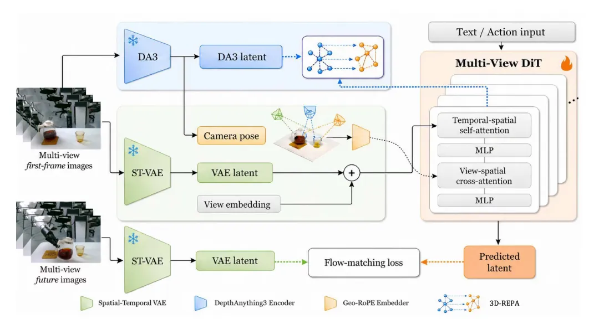

关注两个问题

不同视角的注意力间如何交换信息？
不同视角如何共同构建起一个 3D 先验？

计算的是谁之间的注意力？为什么要计算注意力？
## Model structure

ST-VAE 将高维视频压缩成 latent representation，得到

$$
z_0 \in \mathbb{R}^{T \times H \times W \times C}
$$

在训练时，未来多视角视频会经过 ST-VAE 得到 ground-truth latent，用于和模型预测的 latent 计算 flow-matching-loss

DA 3，即 Depth Anything 3 encoder，用于提供视频图像背后的 3D 空间结构特征（3D-aware feature），用于后面的 Latent 3D-REPA 监督。训练时保持 frozen。
> [!attention]
> 怎么理解这一层损失函数的设计？

$$
\mathcal{L}_{REPA}
=
\mathcal{L}_{spatial}
+
\mathcal{L}_{temporal}
$$

View embedding ：告诉模型某个 latent token 来自哪个视角。
<mark style="background: #FF5582A6;">Geo-RoPE</mark>：

类比 LLM RoPE 中编码的是 token 在一维序列中的位置差；Geo-RoPE 编码的是图像 token 在多相机 3D 空间中的几何关系，也就是文中所述的 camera ray 和 camara pose。

> 一个图像 token 的几何位置 = 这个相机的全局位姿 + 这个 patch 在该相机中的局部射线方向

camera ray 建模**每个 patch/token 自己的几何方向信息**。

$$
d^v(h,w)
=
\text{normalize}
\left(
(R^v)^\top (K^v)^{-1}
\begin{bmatrix}
h+0.5 \\
w+0.5 \\
1
\end{bmatrix}
\right)
$$

camera pose 由相机的外参给出：$[R^v \mid t^v]$
两者结合构成了这个 token 在 3D 空间中的几何含义。

### Attention
Multi-View DiT 可以拆成两类 attention。
Temporal-spatial self-attention：负责建模视频本身的时间和空间结构，主要解决**单视角内部的时间一致性**。

<mark style="background: #FF5582A6;">View-spatial cross-attention</mark>

$$
\hat{Z}^{v}_{t}
=
Z^{v}_{t}
+
\text{gate}
\cdot
\text{softmax}
\left(
\frac{
\tilde{Q}^{v}_{t}
[\tilde{K}^{1}_{t};\ldots;\tilde{K}^{V}_{t}]^\top
}{\sqrt{d}}
\right)
[V^{1}_{t};\ldots;V^{V}_{t}]
$$

在第 $v$ 个视频生成当前 token 时，主动参考其他相机中与它几何对应的 token。

<mark style="background: #FF5582A6;">Latent 3D-REPA</mark>：监督 DiT 中间层的 feature space，采用 token relation distillation 来对齐 token 之间的相似度关系。

$$
S(F)_{i,a}
=
\frac{f_i^\top f_a}{\|f_i\|\|f_a\|}
$$

### Loss
Multi-View DiT 最终输出**Predicted latent**，训练时在 latent space 中学习 flow matching velocity field。
1. 先从真实未来视频 latent $z_{0}$ 和噪声 $\epsilon$ 构造 noisy latent：

$$
z_s = (1-s)z_0 + s\epsilon,\quad \epsilon \sim \mathcal{N}(0,I)
$$

2. 模型预测 velocity：

$$
u_{\theta}(z_s,s)
$$

监督目标是：$\epsilon - z_{0}$ ，因此 flow matching loss：

$$
\mathcal{L}_{diff}
=
\mathbb{E}_{s,\epsilon}
\left[
\|u_{\theta}(z_s,s)-(\epsilon-z_0)\|_2^2
\right]
$$

最终训练损失：

$$
\mathcal{L}_{total}
=
\mathcal{L}_{diff}
+
\lambda \mathcal{L}_{REPA}
$$

论文中设置 $\lambda = 0.5$

