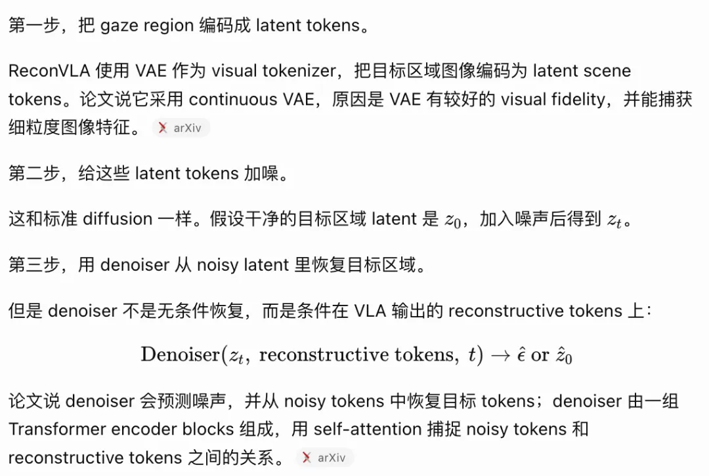

# ReconVLA: Reconstructive Vision-Language-Action Model as Effective Robot Perceiver

## 1. 一句话总结

这篇论文主要解决：传统 Vision-Language-Action Model（VLA，视觉-语言-动作模型）在执行精细操作时视觉注意力容易分散、不能稳定聚焦目标物体的问题；ReconVLA 通过让模型重建当前应操作的 gaze region（注视区域 / 目标操作区域），把视觉重建作为辅助监督信号，从而提升 visual grounding（视觉定位）和精细操作能力。

一句话记忆：

> ReconVLA 不是用 diffusion 生成动作，而是用 diffusion 重建目标区域，逼迫 VLA 学会“该看哪里”。

## 2. 核心贡献

### 2.1 核心贡献 1

提出 **Implicit Grounding（隐式视觉定位）** 范式。

传统 visual grounding 方法通常有两类：

- **Explicit Grounding**：先用外部检测器 / 分割器裁出目标区域，再把 cropped image 输入 VLA。
- **CoT Grounding**：让模型先输出 bounding box，再输出 action。

ReconVLA 的做法不同：它不额外输入裁剪图，也不显式输出 bbox，而是让模型内部生成一组 **reconstructive tokens**，再用这些 tokens 条件化 diffusion denoiser 去重建 gaze region。这样模型为了完成重建任务，必须在内部表征中保留目标区域信息。

### 2.2 核心贡献 2

在普通 VLA 的 action prediction 之外加入 **gaze-region reconstruction loss**。

普通 VLA 的训练目标主要是：

$$
\text{image + instruction} \rightarrow \text{action tokens}
$$

ReconVLA 额外加入一条视觉重建分支：

$$
\text{image + instruction} \rightarrow \text{reconstructive tokens} \rightarrow \text{reconstruct gaze region latent}
$$

因此总训练目标可以理解为：

$$
L_{\mathrm{ReconVLA}} = L_{\text{action}} + L_{\text{visual}}
$$

其中：

- $L_{\text{action}}$：动作 token 的交叉熵损失，用来训练“怎么动”。
- $L_{\text{visual}}$：gaze region 的 diffusion reconstruction loss，用来训练“看哪里”。

### 2.3 核心贡献 3

构建大规模视觉重建预训练数据，并验证该预训练对泛化有帮助。

论文使用 BridgeData V 2、LIBERO、CALVIN 等开放机器人数据集，通过 fine-tuned Grounding DINO 自动提取目标操作区域，构造原图与 gaze region 的配对数据，规模为 100 k+ trajectories / 2 M samples。

预训练的作用是增强模型对目标区域的视觉重建能力，使它在 unseen environment / unseen object 下仍能较好地定位目标并完成动作。

## 3. 数据与任务设置

### 3.1 Data

论文的数据分成两部分：

第一部分是 **visual pretraining data**：

- 来源：
    - BridgeData V 2
    - LIBERO
    - CALVIN
- 标注方式：
    - 使用 fine-tuned Grounding DINO 从 image-text pair 中自动 segment 出 gaze region。
    - 将 original image 和 cropped gaze region image 组织成配对数据。
- 规模：
    - 100 k+ trajectories
    - 2 M samples

第二部分是 **downstream task fine-tuning data**：

- 仿真任务：CALVIN benchmark。
- 真实机器人任务：每个任务平均约 150 条 trajectories。
- 真实机器人评估时，每个任务 20 次 trials。

### 3.2 Robot / Embodiment

仿真环境：

- CALVIN benchmark。
- Franka Panda robot arm。
- PyBullet simulator。

真实机器人：

- 6-DoF AgileX PiPer robotic arm。
- 1-DoF parallel gripper。
- 视觉传感器：
    - RealSense D 515 depth camera as Eye-on-Base。
    - ORBBEC Dabai depth camera as Eye-on-Hand。

### 3.3 Simulation or Real Robot

同时包含 simulation 和 real robot。

Simulation：

- 使用 CALVIN。
- 重点评估 long-horizon manipulation 和 unseen environment generalization。

Real Robot：

- 使用 AgileX PiPer 单臂机械臂。
- 评估真实场景中的多任务操作和 unseen object generalization。

### 3.4 Task

仿真任务：

- CALVIN long-horizon challenge。
- 每个 rollout 需要连续完成 5 个 subtasks。
- 包含 34 个任务和 4 个环境 A/B/C/D。
- 主要测试：
    - ABC→D：训练环境为 A/B/C，测试环境为 D，强调 unseen environment generalization。
    - ABCD→D：包含 D 环境训练，测试基础操作能力。

真实机器人任务：

- Put fruit into bowl
- Stack bowls
- Flip cups
- Bus table

额外测试：

- unseen target object，即替换训练中没有出现过的目标物体，测试目标定位和视觉泛化能力。

## 4. 模型结构

### 4.1 Vision encoder

ReconVLA 基于 LLaVA-7 B 构建，视觉编码器使用：

```text
siglip-so400m-patch14-384
```

作用：

- 将多视角图像编码为 image tokens。
- 作为 VLA backbone 的视觉输入。
- 图像 token 会和 instruction token 共同进入 LLM / VLA backbone。

### 4.2 Language model

LLM backbone 使用：

```text
Qwen2-7B
```

整体 VLM / VLA 基座：

```text
LLaVA-7B
```

语言输入是任务指令，例如：

```text
stack blocks
put the watermelon into the yellow bowl
```

论文还特别提到，为了让图像 token 融合 instruction 信息，会把 instruction tokens 放在 image tokens 前面，使 image tokens 通过 causal attention 融合任务语义。

### 4.3 Action representation

动作仍然采用传统 VLA 的离散动作 token 方式。

普通 VLA 流程：

$$
\text{image tokens + text tokens} \rightarrow \text{LLM} \rightarrow \text{action tokens} \rightarrow \text{action detokenizer} \rightarrow \text{robot action}
$$

ReconVLA 没有把动作输出改成 diffusion policy，也没有像 π0 那样直接用 flow matching 生成 continuous action chunk。

这篇论文的 diffusion 用在视觉重建分支，不是动作生成分支。

### 4.4 Action decoder / head

Action part 输出：

```text
discrete action tokens
```

然后通过 action detokenizer 转换成机器人可执行动作。

可以理解为：

$$
\text{VLA backbone} \rightarrow \text{action tokens} \rightarrow \text{action detokenizer} \rightarrow \text{executable action}
$$

Action loss 是普通的 cross-entropy loss。

### 4.5 World model component

严格说，ReconVLA 不属于标准 World Model / WAM。

它不预测未来图像，也不建模未来世界状态；它重建的是当前 observation 中的目标操作区域，也就是 gaze region。

因此更准确的分类是：

```text
VLA + auxiliary visual reconstruction supervision
```

而不是：

```text
VLA + future world model
```

它和 WorldVLA / DreamZero 的区别在于：

- WorldVLA / DreamZero：预测 future image / future world state，用未来动态辅助动作生成。
- ReconVLA：重建 current gaze region，用当前目标区域监督视觉注意力。

### 4.6 Latent passing / intermediate representation

这是 ReconVLA 最关键的机制。

整体流程：

```text
multi-view images + instruction
        ↓
VLA / LLM backbone
        ↓
分成两条路径
        ↓
1. action part: 输出 action tokens
2. reconstructive part: 输出 reconstructive tokens hR
        ↓
gaze region image I' 经 VAE 编码成 scene tokens z0
        ↓
给 z0 加噪得到 zt
        ↓
denoiser D(zt; hR, t) 预测噪声 ε
        ↓
通过 diffusion loss 训练重建 gaze region latent
```

关键变量：

- $I'$：gaze region image，即当前要操作的目标区域。
- $F$：frozen visual tokenizer，论文中使用 continuous VAE。
- $z_0 = F(I')$：gaze region 的 latent scene tokens。
- $z_t$：对 $z_0$ 加噪后的 noisy tokens。
- $h_R$：VLA 输出的 reconstructive tokens，可理解为任务相关的视觉中间表示。
- $D$：diffusion transformer denoiser。
- $t$：diffusion timestep。

训练目标：

$$
L_{\text{visual}} = \mathbb{E}_{t,\epsilon}\left[\left\lVert D(z_t; h_R,t)-\epsilon \right\rVert^2\right]
$$

直观理解：

> 如果 VLA 的 visual output 没有真正包含目标区域信息，denoiser 就无法根据 hR 从 noisy latent 中恢复 gaze region；因此 reconstruction loss 会反向约束 VLA backbone，使其学会关注目标物体。

## 5. Evaluation

### 5.1 Benchmark

主要 benchmark：

- CALVIN ABC→D
- CALVIN ABCD→D

CALVIN 设置：

- 34 tasks。
- 4 environments：A、B、C、D。
- Long-horizon challenge：每个 rollout 连续执行 5 个 subtasks。
- 每种方法评估 500 rollouts。

核心对比设置：

- ABC→D：测试 unseen environment generalization。
- ABCD→D：测试常规长程操作能力。

### 5.2 Real robot

真实机器人设置：

- 6-DoF AgileX PiPer robotic arm。
- 1-DoF parallel gripper。
- RealSense D 515 as Eye-on-Base。
- ORBBEC Dabai as Eye-on-Hand。

真实任务：

- Put fruit into bowl
- Stack bowls
- Flip cups
- Bus table

评估方式：

- 每个任务 20 trials。
- 指标为 success rate。
- 额外测试 unseen target objects。

主要结果：

- ReconVLA 在四个真实任务上均优于 OpenVLA 和 PD-VLA。
- 在 Put Fruit into Bowl 和 Stack Bowls 上接近或超过 90% success rate。
- 在 unseen target object 设置下，OpenVLA 和 PD-VLA 接近 0%，ReconVLA 仍能完成部分任务。

### 5.3 Simulation

仿真实验主要回答五个问题：

1. Implicit Grounding 是否优于 Explicit Grounding / CoT Grounding？
2. gaze mechanism 是否真的改善 visual attention？
3. visual pretraining 是否提升 reconstruction generalization？
4. ReconVLA 是否能处理 long-horizon tasks？
5. 方法是否能迁移到真实机器人和 unseen targets？

关键结果：

Paradigm comparison on CALVIN ABC→D：

|Method|1/5|2/5|3/5|4/5|5/5|Avg. Len|
|---|--:|--:|--:|--:|--:|--:|
|Baseline|88.8|76.1|63.7|57.0|49.0|3.36|
|Explicit Grounding|94.4|82.5|70.9|62.2|50.2|3.61|
|CoT Grounding|47.0|14.3|1.6|0.0|0.0|0.63|
|ReconVLA / Implicit Grounding|95.6|87.6|76.9|69.3|64.1|3.95|

State-of-the-art comparison on CALVIN ABC→D：

- OpenVLA：5/5 success rate 43.5，Avg. Len 3.27。
- UniVLA：5/5 success rate 56.5，Avg. Len 3.80。
- ReconVLA：5/5 success rate 64.1，Avg. Len 3.95。

State-of-the-art comparison on CALVIN ABCD→D：

- GR-1：Avg. Len 4.21。
- RoboFlamingo：Avg. Len 4.08。
- ReconVLA：Avg. Len 4.23。

Precise manipulation：

- Stack block task baseline：59.3%。
- ReconVLA with gazing mechanism：79.5%。
- 提升 20.2%。

Ablation：

|Recon.|Gaze Region|Pretrain|5/5|Avg. Len|
|---|---|---|--:|--:|
|✓|✓|✓|64.1|3.95|
|✓|✓|×|58.2|3.85|
|✓|×|×|46.5|3.42|
|×|×|×|49.0|3.36|

结论：

- reconstruction 有帮助。
- gaze region reconstruction 比 whole-image reconstruction 更有效。
- large-scale visual pretraining 对 unseen environment 下的泛化有明显提升。

### 5.4 Main metric

主要指标：

- Success Rate。
- CALVIN 中报告连续完成 1/5 到 5/5 subtasks 的 success rate。
- Average completed length / Avg. Len，即平均连续完成多少个 subtasks。
- Real robot 中使用 per-task success rate。

### 5.5 Baseline

视觉 grounding 范式对比：

- Baseline VLA。
- Explicit Grounding，使用 YOLOv 11 检测目标并输入 cropped image。
- CoT Grounding，先输出 bbox 坐标再输出 action。
- Implicit Grounding，即 ReconVLA。

Generative methods：

- UniPi
- SuSIE
- GEVRM
- GR-1
- Vidman
- CLOVER
- 3D-VLA

Large VLA models：

- VLAS
- RoboFlamingo
- OpenVLA
- UniVLA

Real-world baselines：

- OpenVLA
- PD-VLA

## 6.我的理解与疑问

我认为这篇论文最值得记住的是：

ReconVLA 的关键不是提出一个新的动作生成器，而是提出一个 VLA 视觉感知增强方法。它保留传统 VLA 的 action token prediction，但增加 gaze region reconstruction 作为辅助监督，让模型在训练中学会聚焦当前真正要操作的目标区域。

最简洁的理解：

```text
action loss 训练模型怎么动；
reconstruction loss 训练模型该看哪里。
```

因此，ReconVLA 应该被归类为：

```text
VLA perception / grounding enhancement
```

而不是：

```text
Diffusion Policy
World Model
World Action Model
```

我还没理解清楚的是：
1. 如何去理解 reconstructive token，它是如何被生成的？它的作用是什么？
2. 和 Diffusion Policy 相比，该论文中的 Diffusion 区别是什么？作用是什么？



后续可以追踪的问题 / 论文：

视觉 grounding 方向：

- RoboGround
- VIP
- ECoT
- GraspVLA

VLA 基础模型方向：

- RT-2
- OpenVLA
- UniVLA
- π0
