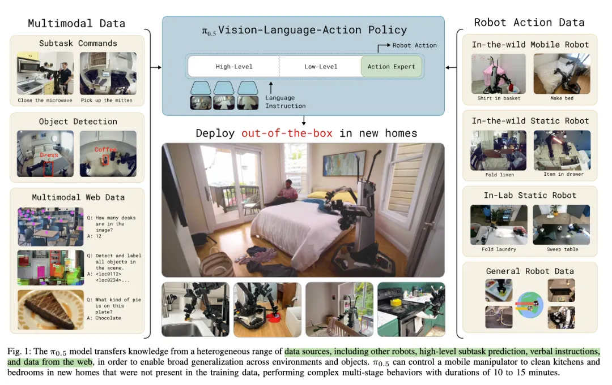
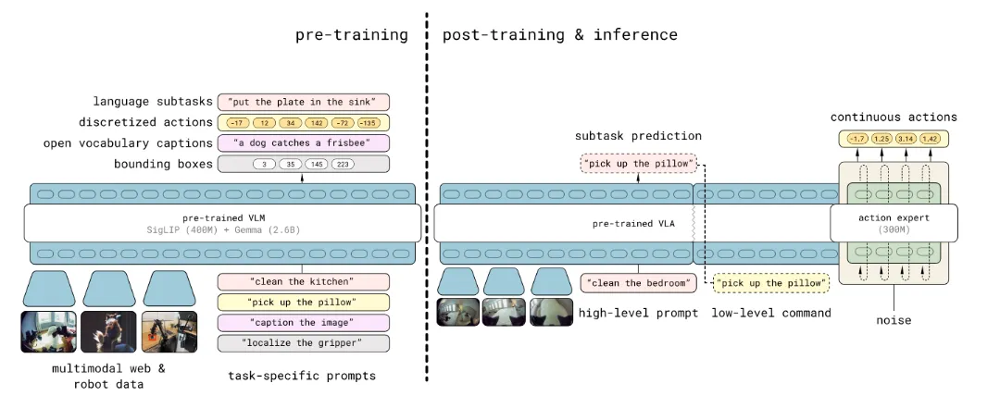

π0.5 想通过**多来源、多层次数据协同训练**，获得更强的 open-world generalization



把任务拆解成：高层任务和可执行的子任务，再根据子任务生成动作。
即：`高层任务 prompt -> 高层 subtask prediction -> 低层 action chunk prediction -> 机器人执行`。
用公式表示如下：

$$
\pi_\theta(a_{t:t+H}, \hat{\ell} \mid o_t, \ell)
=
\pi_\theta(a_{t:t+H} \mid o_t, \hat{\ell})
\pi_\theta(\hat{\ell} \mid o_t, \ell)
$$

**Pre-training**
```text
continuous robot action chunk
-> Fast tokenizer
-> discrete action chunks
-> cross entropy training
```
pre-training 使用离散 token 形式训练，动作部分使用 FAST action tokenizer，把动作转换成离散 token，方便训练语言模型做 next-token prediction。
普通交叉熵损失：

$$
\mathcal{L}_{CE}
=
H(x_{1:M}, f_\theta^\ell(o_t, \ell))
$$

**Post-training**
> 这里 flow matching 的理论可以参考 [[Flow Matching]]

post-training 加入 flow matching action expert，用 continuous action chunk 做实时控制。

输入：

$$
a_{t:t+H}^{\tau,\omega}
=
\tau a_{t:t+H}
+
(1-\tau)\omega,
\quad
\omega \sim \mathcal{N}(0, I)
$$

action expert 训练预测目标 flow vector field，即预测 $w - a_{t:{t+H}}$
**flow matching loss**

$$
\alpha
\left\|
\omega - a_{t:t+H}
-
f^a_\theta(a^{\tau,\omega}_{t:t+H}, o_t, \ell)
\right\|^2
$$


综上，完整训练目标可概括为：

$$
\mathcal{L}
=
\mathcal{L}_{CE}
+
\alpha
\left\|
\omega - a_{t:t+H}
-
f_\theta^a(a_{t:t+H}^{\tau,\omega}, o_t, \ell)
\right\|^2
$$

在 pre-training 阶段，预设 $\alpha = 0$；在 post-training 阶段，设置 $\alpha = 10$。

**Inference**
生成当前 subtask

$$
\hat{\ell} \sim \pi_\theta(\hat{\ell} \mid o_t, \ell)
$$

基于 $\ell$ 用 action expert 生成连续动作，这一步通过 flow matching 迭代去噪得到（论文中提到 `step=10`）。

$$
a_{t:t+H} \sim \pi_\theta(a_{t:t+H} \mid o_t, \hat{\ell})
$$

## 模型架构

### Backbone
VLM-based VLA：SigLIP + Gemma

### Input & Output
输入：$x_{1:N}$，可以说 text token、image patch 或 denoising value of action
输出：$y_{1:N} = f(x_{1:N}, A(x_{1:N}), \rho(x_{1:N}))$
输出 $y_ {{1:N}}$ 可以被拆成两部分：$(y_{1:M}^{\ell}, y_{1:H}^{a})$，前者属于 token logits，用于生成 subtask，FAST action token 等，后者用于连续动作生成。

生成动作策略上和 OpenVLA 的不同：
OpenVLA 本质上借助了 VLM 的 next-token-prediction，sampling 是分类问题，即：

$$
p(\text{action token} \mid o_t, \ell)
$$

而 π0.5 是连续生成动作，即：

$$
p(a_{t:t+H} \mid o_t, \hat{\ell})
$$

### Normalization
**标准 RMSNorm**
设某一层的 hidden state 为 $x$，RMSNorm 计算 root mean square：

$$
\mathrm{RMS}(x)=\sqrt{\frac{1}{d}\sum_{i=1}^{d}x_i^2+\epsilon}
$$

归一化后，

$$
\hat{x}=\frac{x}{\mathrm{RMS}(x)}
$$

标准 RMSNorm 输出为：

$$
\mathrm{RMSNorm}(x)=\hat{x}\odot \gamma
$$

在 Gemma / LLaMA 这类变体里，常表达为：

$$
\mathrm{RMSNorm}(x)=\hat{x}\odot (1+w)
$$

其中，初始化 $w = 0$。

**AdaRMSNorm**
由于 π0.5 采取 flow matching 生成动作，添加条件变量 conditional modulation，即 $\tau$
先把时间步编码成条件向量

$$
c_{\tau}=\mathrm{MLP}(\phi(\tau))
$$

再由 $c_{\tau}$ 生成归一化层的动态调制参数：

$$
s_{\tau}, b_{\tau}, g_{\tau}
=
\mathrm{Linear}(c_{\tau})
$$

AdaRMSNorm 的主体可以写成：

$$
\mathrm{AdaRMSNorm}(x,c_{\tau})
=
\hat{x}\odot(1+s_{\tau})+b_{\tau}
$$

这里的 $g_{\tau}$ 充当门控层。
目的是：**让 action expert 知道当前处于哪一个降噪阶段。**
